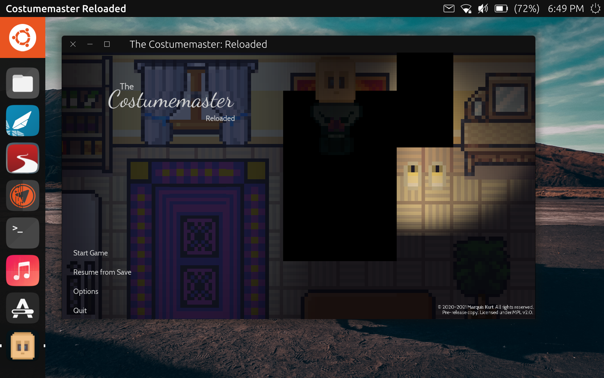

# Ubuntu Touch Click Packages

The following subdirectory contains the necessary development files to create a click package of the game for [Ubuntu Touch](https://ubuntu-touch.io). Special thanks to @abmyii and the UBPorts team for making this possible.



## Build instructions

Start by building the project as you would for standard, x86-64 Linux*. Copy the resulting .pck file from the `dist/linux` directory (or whereever you specified the Linux export) into the `clickable` directory and rename it to `costumemaster.pck`. In the terminal, run the following:

```
$ cd clickable
$ clickable build
```

The resulting click file should be present in the `build` directory inside of `clickable`, which can be installed on an Ubuntu Touch device by copying the file over.

> \*You may also use the "Export PCK/ZIP" option instead of "Export Project", as the binary file(s) is/are not necessary for building the click package. Clickable will download a custom Godot binary.

### Multiple architectures

Note: To build for different architectures, pass in the `CLICKABLE_ARCH `environment variable.

For example, to build for armhf and arm64:
```
$ CLICKABLE_ARCH=armhf clickable build
$ CLICKABLE_ARCH=arm64 clickable build
```
> Note: It is recommended that you provide packages for at least the `armhf` and `arm64` architectures.

### Important notes regarding visual rendering

Currently, the game uses GLES3 as its rendering backend, with a fallback to GLES2 if necessary. Some Ubuntu Touch devices may witness visual glitches depending on graphics hardware limitations. 